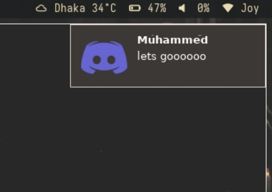
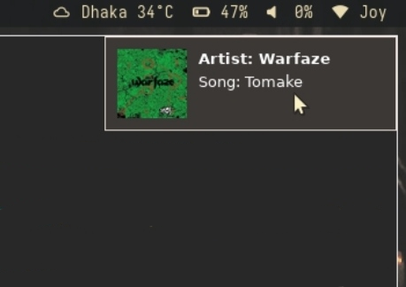

<div align="center">

# tnotd

### Termux Notification Daemon for X11

<p>
  
  
  
  
</p>

<p>A lightweight Termux daemon written in C that captures Android notifications via the Termux:API service and displays them in X11-based environments using GTK</p>

</div>

---

## 🎯 Overview

**tnotd** (Termux Notification Daemon) bridges Android notifications to X11 desktop environments running on Termux. It listens for Android system notifications through the Termux:API and displays them as native X11 notifications.

---

## ✨ Features

- 🔔 Real-time Android notification forwarding to X11
- 🎨 GTK-based notification display
- ⚙️ Configurable app-specific notification handling
- 🪶 Lightweight and efficient daemon
- 🔧 Easy to customize and extend

---

## 📦 Requirements

### System Dependencies

- **Termux** app (from F-Droid or GitHub)
- **Termux:API** app (from F-Droid or GitHub)
- **termux-api** package with proper permissions granted

### Build Dependencies

```bash
pkg install git clang gtk3 libnotify termux-api xorgproto
```

---

## 🛠️ How to Build and Install

```bash
git clone https://github.com/nurmuhammedjoy/tnotd.git
cd tnotd
make
make install
make clean
```

---

## 🚀 How to Use

### Display a Single Notification

If you want to display a one-time notification:

```bash
tnotd "title" "description" image.file
```

### Run as a Daemon

To run the notification daemon continuously:

```bash
daemon
```

### Configuration

You can configure which apps trigger notifications by editing the `daemon.c` file:

```c
// Configuration
AppConfig app_configs[] = {
    {"com.discord", "discord", "tnotd '{TITLE}' '{CONTENT}' images/discord.png"},
    {"com.spotify.music", "spotify", "tnotd 'Artist: {CONTENT}' 'Song: {TITLE}' images/spotify.png"},
    // Add more apps here if needed
};
```

> also you can customise your appearance this `notification.c`


---

## Preview




---

> **Note:** Approximately 30% of the initial code was written using AI assistance, so there may be it has some bug.

##  Contributing

Contributions are welcome! Feel free to:

- 🐛 Report bugs
- 💡 Suggest features
- 🔧 Submit pull requests

<div align="center">

### How to Contribute

</div>

1. Fork the repository
2. Create your feature branch (`git checkout -b feature/amazing-feature`)
3. Commit your changes (`git commit -m 'Add amazing feature'`)
4. Push to the branch (`git push origin feature/amazing-feature`)
5. Open a Pull Request

---

## 📄 License

<div align="center">

This project is licensed under the **GNU General Public License v3.0**

[](https://www.gnu.org/licenses/gpl-3.0)

See [LICENSE](LICENSE) for more information.

</div>

---

<div align="center">

### 🌟 Star this repository if you find it useful!

Made with ❤️ by [nurmuhammedjoy](https://github.com/nurmuhammedjoy)

<p>
  <a href="https://github.com/nurmuhammedjoy/tnotd/issues">Report Bug</a>
  ·
  <a href="https://github.com/nurmuhammedjoy/tnotd/issues">Request Feature</a>
</p>

</div>
